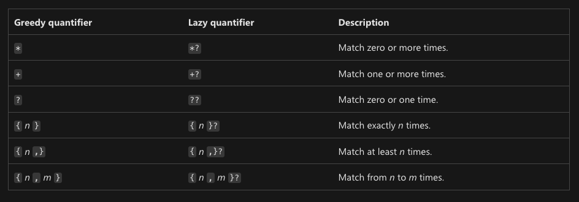
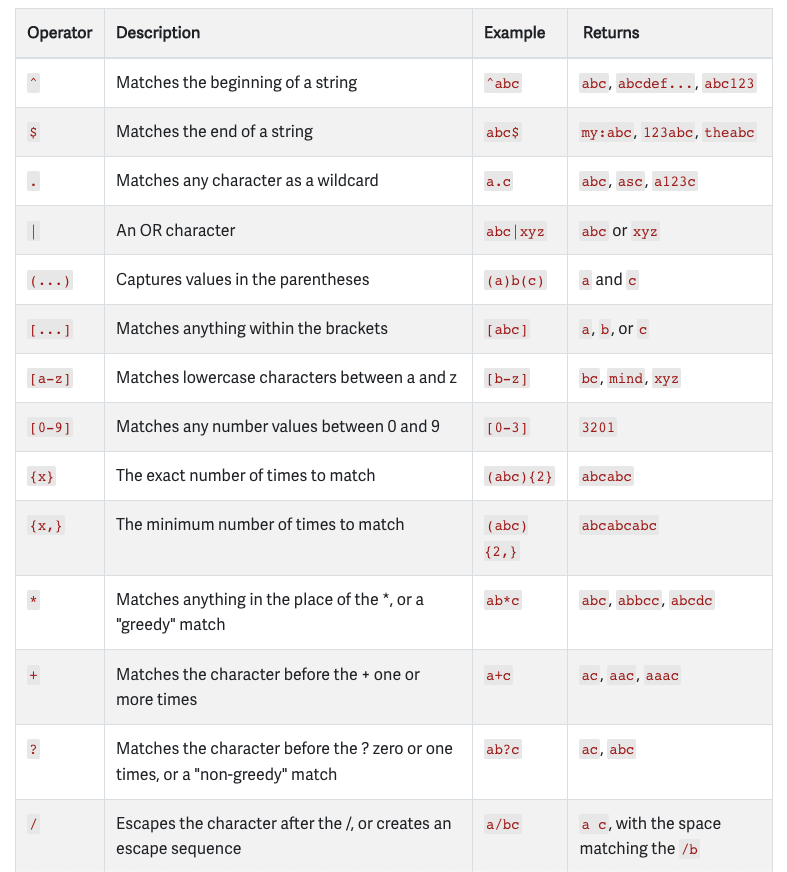
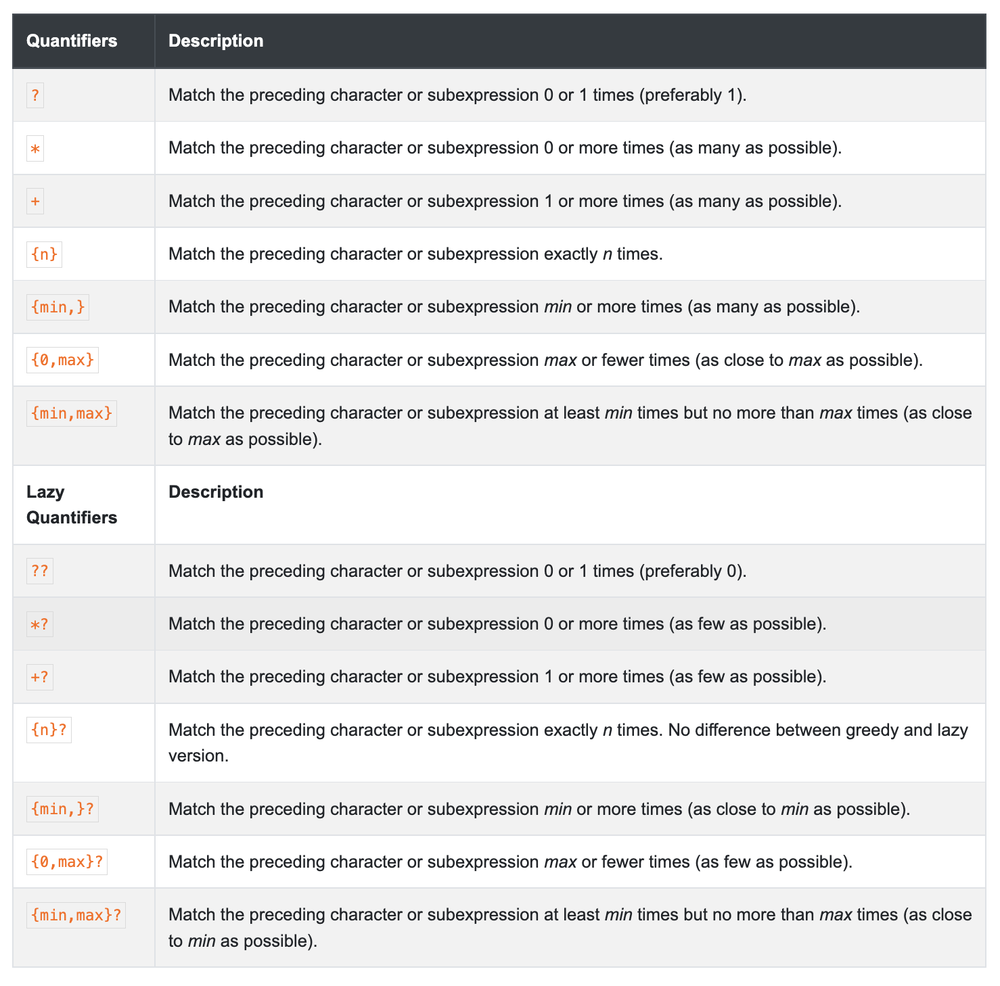

# Regex Tutorial - Phone number Search.

Regex, short for regular expression, is a string of text that allows you to create patterns that help match, locate, and manage text. It is language agnostic meaning it works in all programming languages and most text editors.

## Summary

```
\(?\d{3}[-.)\d{3}[-.]\d{4}
```

This is the regex that will be explained today. It is widely used in North America to validate phone numbers. The topics covered in this tutorial will be the composition of the expression and each part is doing.

## Table of Contents

- [Anchors](#anchors)
- [Quantifiers](#quantifiers)
- [OR Operator](#or-operator)
- [Character Classes](#character-classes)
- [Flags](#flags)
- [Grouping and Capturing](#grouping-and-capturing)
- [Bracket Expressions](#bracket-expressions)
- [Greedy and Lazy Match](#greedy-and-lazy-match)
- [Boundaries](#boundaries)
- [Back-references](#back-references)
- [Look-ahead and Look-behind](#look-ahead-and-look-behind)

## Regex Components

### Anchors

Anchors match a position before, after or between characters. They can be used to “anchor” the expression match at a certain position.

- The two main anchors consist of '^' that matches the position before the first character and '$' that matches right after the last character.
- In this regex we are not using any anchors

### Quantifiers

Quoted from the mozilla developer website "Quantifiers indicate numbers of characters or expressions to match". There are different types of quantifiers that allow you to manipulate the expression.

- In this regex we are using quantifiers every time we are searching for digits such as: `{3}`

  

### OR Operator

These operators let us search for a pattern within the | symbol also called a pipe and it functions just as in programming OR.



### Character Classes

"With a “character class”, also called “character set”, you can tell the regex engine to match only one out of several characters. Simply place the characters you want to match between square brackets." - Cited from the https://developer.mozilla.org

- In our regex example we are using or operators within the brackets to search for dashes or periods within the phone number.

### Flags

Flags may be added to the end of a regular expression to give access to more serch patterns, like 'g' matching the pattern multiple times.

    g: matches the pattern multiple times
    i: makes the regex case insensitive
    m: enables multi-line mode. Where ^ and $ match the start and end of the entire string. Without this, multi-line strings match the beginning and end of each line.
    u: enables support for unicode
    s: short for single line, it causes the . to also match new line characters

### Grouping and Capturing

This is a method of grouping multiple characters in a single unit. They are created by placing the characters to be grouped inside a set of parentheses. For example the expression `(ABC)` would find any sequence of characters that are capitalized and are either A, B or C

### Bracket Expressions

"A bracket expression (an expression enclosed in square brackets, "[]" ) is an RE that shall match a specific set of single characters, and may match a specific set of multi-character collating elements, based on the non-empty set of list expressions contained in the bracket expression." - https://pubs.opengroup.org/

These search patterns are put inside brackets like the following example: `[A-Z]` this search pattern will look for any characters within the range of A-Z capitalized

### Greedy and Lazy Match

These are quantifiers that either match as many as possible or as few as possible hence the name Greedy and Lazy.


### Boundaries

Boundries are a metacharacter represented by a backslash '\'

There are three different positions that qualify as word boundaries:

    Before the first character in the string, if the first character is a word character.
    After the last character in the string, if the last character is a word character.
    Between two characters in the string, where one is a word character and the other is not a word character.

### Back-references

- https://www.computerhope.com/jargon/r/regex.htm
- https://www.youtube.com/watch?v=EfJU0Y9WAZ4 - TheCodingTrain Youtube channel
- https://www.regular-expressions.info/
- https://developer.mozilla.org/
- https://https://stackoverflow.com/

### Look-ahead and Look-behind

Lookarounds are zero width assertions. They check for a regex (towards right or left of the current position - based on ahead or behind), succeeds or fails when a match is found (based on if it is positive or negative) and discards the matched portion.

## Author

My name is Ben and I am a full stack developer with a love for the gaming community. Please feel free to check out my github profile at https://github.com/benjamind10 or send me an email to ben@bytebug.io
